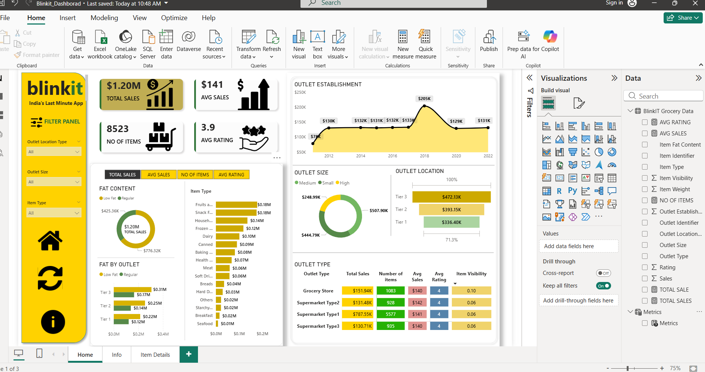
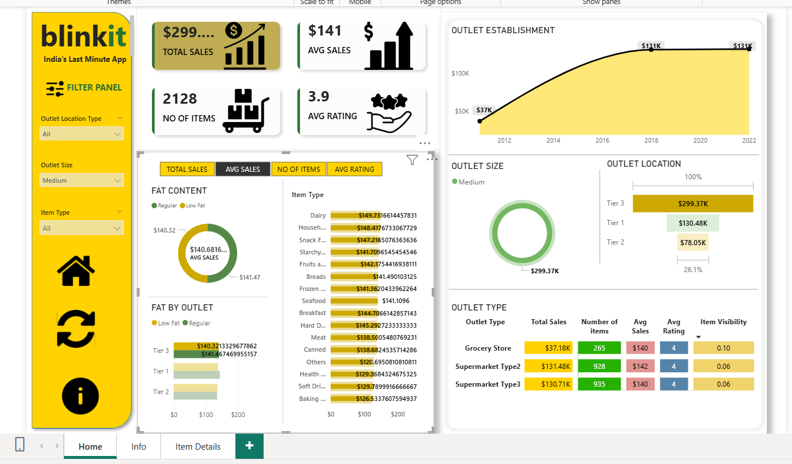
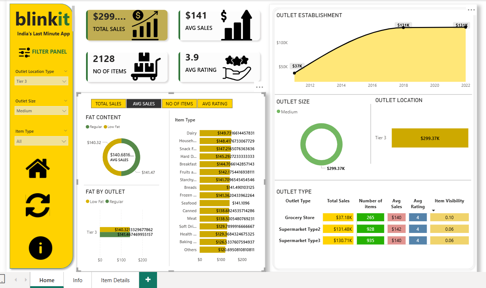
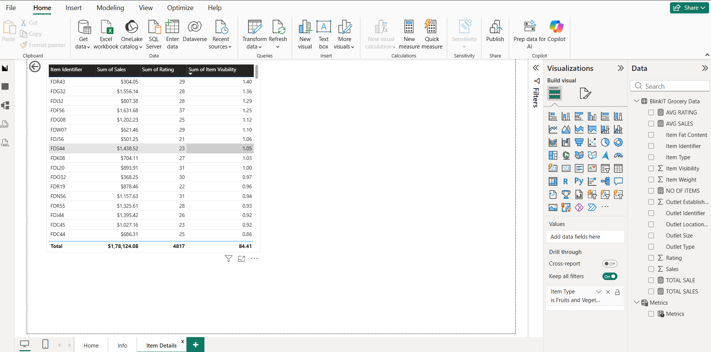
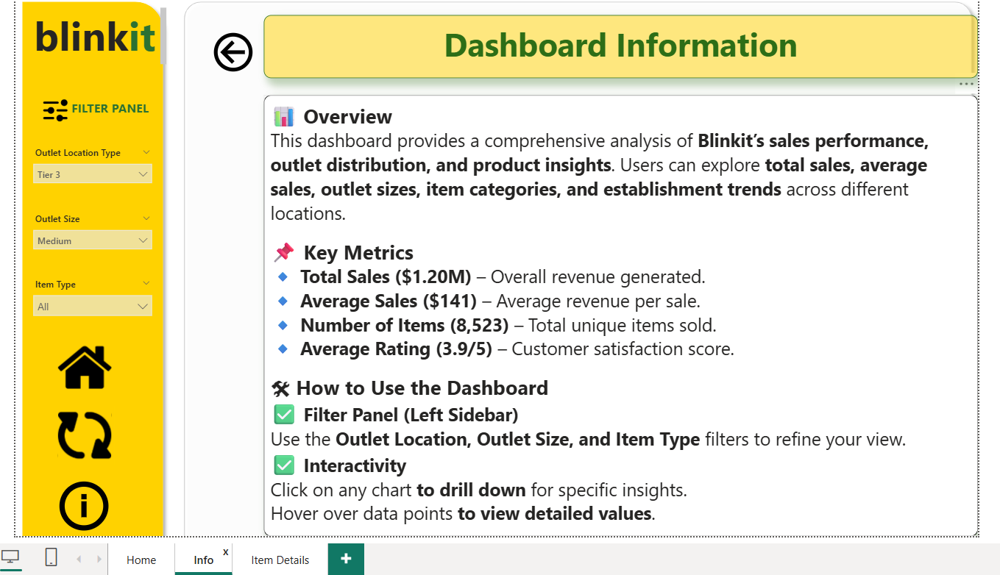

# Blinkit Sales Dashboard – Power BI

## Project Overview

This is my first Power BI dashboard created while learning data visualization and business intelligence concepts.

The dashboard analyzes Blinkit grocery sales performance, outlet distribution, and product category insights using interactive visuals and KPIs.

---

## Objectives

* Understand sales performance across outlet types
* Analyze product category contribution
* Explore outlet size and location impact
* Practice dashboard design and user interaction

---

## Key Metrics

* Total Sales
* Average Sales
* Number of Items Sold
* Average Customer Rating

---

## Dashboard Features

* Interactive slicers (Outlet Size, Location, Item Type)
* Sales trend analysis
* Category-wise performance
* Outlet segmentation
* Item-level insights

---

## Tools Used

* Power BI
* DAX
* Data Visualization
* Data Cleaning

---

## Project Type

Learning project — focused on building foundational Power BI dashboarding skills.

---

## Files Included

* PBIX Dashboard file
* Dataset used for analysis
* Dashboard screenshots

---

## Dashboard Preview

